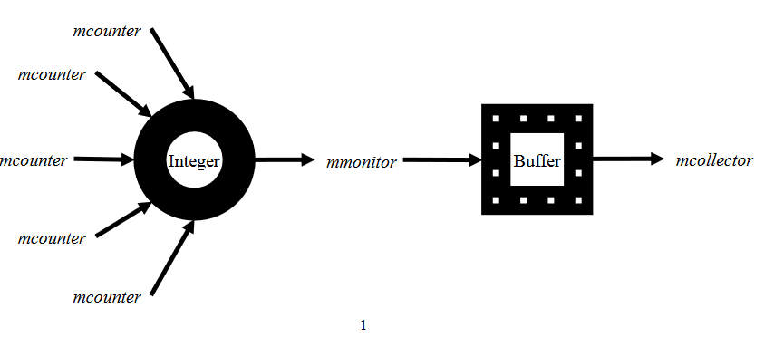

# Producer-Consumer-using-Semaphores

## Problem Statement:
You are required to write a C program to solve the following synchronization problem using POSIX and “semaphore.h” libraries.

N mcounter threads  count  independent  incoming  messages  in  a  system,  and  another  thread mmonitor gets the count of threads at time intervals of size t1, and then resets the counter to 0. The mmonitor then places this value in a buffer of size b, and a mmcollector thread reads the values from the buffer.

Any  thread  will  have  to  wait  if  the  counter  is  being  locked  by  any  other  thread.  Also,  the mmonitor and mcollecttor threads will not be able to access the buffer at the same time or to add another entry if the buffer is full.

Assume that the messages come randomly to the system, this can be realized if the mcounter threads sleep for random times, and their activation (sleep time ends) corresponds to an email arrival. Similarly, the mmonitor and mcollector will be activated at random time intervals.

### Hints:
#### Divide up the problem into two sub-problems
(a)P1:  counter  threads  count  messages  and  add  them  to  the  counter  shared variable, and monitor thread reads it. 
(b)P2: monitor thread places the count in the buffer and collector thread reads it. 

### Sample Run:
Your sample run will show a sequence of the behavior of each thread at the times of their activation (at random intervals), for example:
 
 
counter #: 5 
Counter thread 3: received a message 
Counter thread 4: received a message 
Counter thread 4: waiting to write 
Counter thread 1: received a message 
Counter thread 1: waiting to write 
Collector thread: nothing is in the buffer! 
Counter thread 2: received a message 
Counter thread 2: waiting to write 
Counter thread 3: now adding to counter, counter value=1 
Counter thread 0: received a message 
Counter thread 0: waiting to write 
Counter thread 4: now adding to counter, counter value=2 
Counter thread 1: now adding to counter, counter value=3 
Monitor thread: reading a count value of 3 
Monitor thread: writing to buffer at position 0 
Counter thread 2: now adding to counter, counter value=1 
Counter thread 0: now adding to counter, counter value=2 
Monitor thread: waiting to read counter 
Collector thread: reading from buffer at position 0 
Monitor thread: reading a count value of 2 
Monitor thread: writing to buffer at position 0 
Collector thread: reading from buffer at position 0 
 
